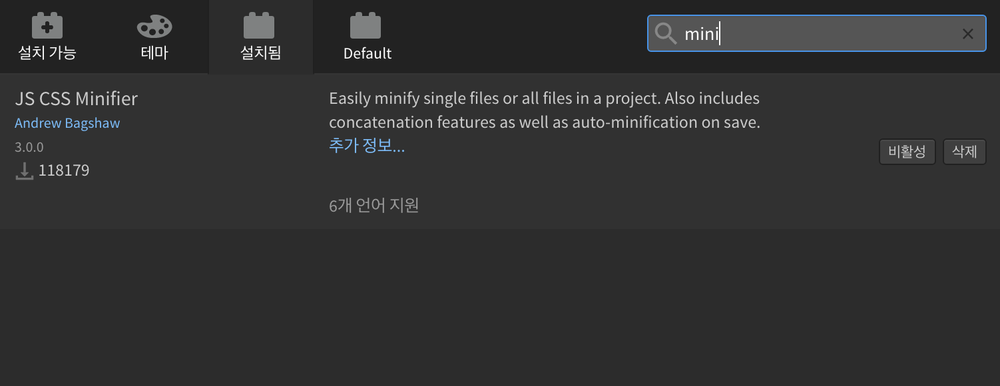

# How To Minify CSS Files

### 1. Use 'clean-css-online' Service.
 - Click [here](http://adam.id.au/clean-css-online/) to use 'clean-css-online'.

### 2. Install and Use 'JS CSS Minifier' inside of Bracket.

### 3. Install and Use 'clean-css-cli' in Mac Terminal.
`sudo npm install -g clean-css`

`sudo npm install -g clean-css-cli`

`cleancss -o original_file.min.css original_file.css`

`cat original_file.min.css`

