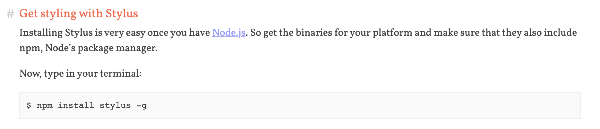

# How To Compile Stylus To CSS Files

### 1. Use 'Stylus Auto Compile' extension inside of Bracket.

### 2. Use stylus in Mac terminal.
 - Install stylus with npm.

 - Click [here](https://github.com/stylus/stylus) to see usage.
 
 - Basic usage 
 
 `stylus style.styl -o style.css`
 
 `stylus -w style.styl -o style.css` (`-w` : watch option)
 
 