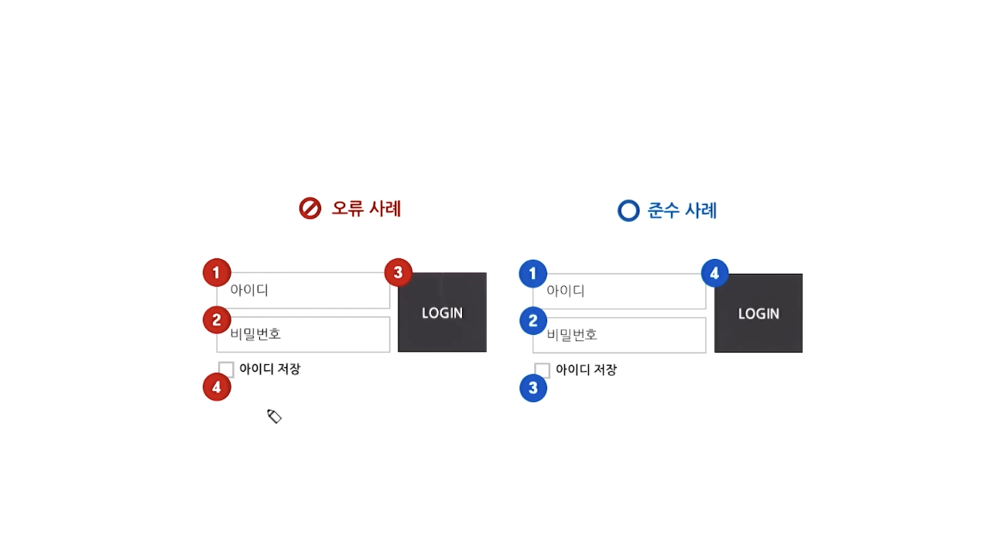

# 웹 접근성 (Web Accessibility)


### 1. 웹 접근성이란 ?
 - 어떠한 사용자가 어떠한 기술환경에서도 전문적인 능력 없이 웹 사이트에서 제공하는 모든 정보에 접근할 수 있도록 보장하는 것이다.
 - 모든 사용자가 모든 기기에서 웹에 접근할 수 있도록 하는 것이다.


### 2. 웹 접근성을 준수해야 하는 이유
 - 장애인 차별 금지법 (장차법)
 
 ```
     장차법에서는 2013년 4월 11일부터 장애인들도 비장애인과 동등하게 전자정보 및 비전자정보를 사용할 수 있도록 해야 한다는 내용이 포함되어 있습니다.

     장애인 차별 금지법 처벌 법적 진행 절차 1
     1. (인권위)민/형사 고발
     2. 형사:3개월 이내 수사, 민사:손해배상제도 절차
     3. 악의로 인정될 경우 3년 이하 징역 또는 3천 만원 이하 벌금
```
 
 
 - 장애환경
 
 
    > 장애 환경에는 여러 장애들과 노안, 운전 중일 때, 소음이 심할 때, 스피커가 없어서 소리를 듣지 못할 때, 소프트웨어가 지원되지 않거나 네트워크가 접속되지 않는 경우들도 있습니다.
    
    
### 3. 웹 접근성 지침
 - WCAG(Web Content Accessibility Guidelines)
 ```
    W3C에서 발표한 웹 콘텐츠 접근성 지침.
    1990년대부터 영국 · 호주 · 미국 · 일본 등이 장애인 차별 금지 관련법에 따라 모든 이의 웹 접근성을 높였으며, 1997년 5월 W3C가 '웹 콘텐츠 접근성 지침(WCAG)'를 내놓아 제도 확산에 속도를 더했다. 
 ```
    
 - KWCAG(Korean Web Content Accessibility Guidelines)
 ```
    해외 웹 표준 기술 동향을 토대로 국내 설정에 맞게 반영된 한국형 웹 콘텐츠 접근성 지침.
    한국도 2009년 5월 '국가 정보화 기본법'을 개정해 '장애인 · 고령자 등의 정보 접근 및 이용 보장'을 명시했으며, 2015년까지 한국 내 모든 인터넷 사이트가 웹 접근성을 보장하게 규정했다.
  ```
  
  
### 4. 웹 접근성 준수하기
#### 4-1. 텍스트 콘텐츠 명도 대비
 - 텍스트 콘텐츠와 배경 간의 명도 대비는 4.5 : 1 이상이 되도록 한다.
 - [Color Contrast Analyser](https://developer.paciellogroup.com/resources/contrastanalyser/) 와 같은 프로그램을 이용할 수 있다.
   
   
#### 4-2. 자동 재생 금지
 - 웹 페이지에서는 소리가 자동 재생됨으로 인해 스크린리더 사용자가 콘텐츠를 인식하고 사용하는데 방해받지 않아야 한다.
 - 불가피하게 제공할 경우 해결 방안
 ```
    3초 내에 정지
    ESC 키 선택 시 정지
    소스 상 가장 먼저 제공하여 정지 기능 실행 가능하도록 구현
 ```
 
#### 4-3. 이웃한 콘텐츠 구분
 - 테두리 이용하여 구분
 - 콘텐츠 사이에 시각적인 구분선을 삽입하여 구분
 - 서로 다른 무늬를 이용하여 구분
 - 콘텐츠 배경색 간의 명도대비(채도)를 달리하여 구분
 - 줄 간격 및 글자 간격을 조절하여 구분
 - 기타 콘텐츠를 시각적으로 구분할 수 있는 방법을 통해 구분
 
 
#### 4-4. 키보드 사용 보장
 - 웹 페이지에서 제공하는 모든 기능을 키보드만으로도 사용할 수 있도록 제공해야 한다.
    > 마우스를 사용하지 못하는 키보드 사용자는 키보드로 웹 페이지를 탐색한다.
    
 - 키보드 접근 시에도 드롭 다운 메뉴가 노출되고 메뉴에 접근 가능하도록 구현
 - 키보드 접근 시에도 자동 롤링되어 전체 콘텐츠가 노출되도록 구현
 - 특정 버튼 키보드 접근 시에도 레이어가 노출되도록 구현
 - 마우스로 조작 가능한 요소의 경우 되도록 `<a>` 링크나 버튼과 같이 초점을 받을 수 있는 요소로 구현
 - `<a>` 링크에는 href 속성을 반드시 제공 (onclick 속성은 마우스로는 조작이 가능하지만 키보드 접근 불가능)
    ```html
        <a onclick="getAd()">Click</a> (X)
        <a href="javascript:getAd()">Click</a> (O) 
    ```
    
 - `onfocus="this.blur();"` 속성 값은 focus를 초기화시켜 다음 콘텐츠로 이동할 수 없으므로 제거
 - 키보드가 함정에 빠지지 않고 마우스 사용시와 동일하게 접근 가능하도록 구현
  
  
#### 4-5. 논리적 & 시각적 초점 이동
 - 초점 이동은 논리적 구조로 마크업하여 사용자가 예측하는 이동 순서와 일치해야 한다.
 
 
 - 기본적으로 마크업이 논리적으로 이루어져 있다면 굳이 tabindex 속성을 사용할 이유는 없다.
 - 레이어 팝업을 노출시키는 요소 > 레이어 팝업 내부 > 레이어 팝업 닫기 > 레이어 팝업 노출시키는 요소 순으로 이동해야 한다.
 - 요소에 hidefocus 속성을 적용하거나 CSS에서 outline: none; 처리는 포커스를 보이지 않게 하므로 주의한다.
 
 
#### 4-6. 조작 가능
    > 비장애인들도 컨트롤이 작으면 조작이 힘든데, 정교한 마우스 조작을 할 수 없는 사용자는 더 힘들다.
    
 - 컨트롤 요소의 대각선 길이는 6mm 이상으로 구현한다.
 - 컨트롤이 연달아 있을 때 1px 이상의 여백이 있도록 구현한다.
 
 
#### 4-7. 응답 시간 조절
 - 콘텐츠를 탐색하는데 시간이 오래 걸리는 사용자를 위해 시간제한이 있는 콘텐츠는 응답 시간을 조절할 수 있어야 한다.
 - 세션 시간이 20시간 이상인 콘텐츠는 예외로 간주한다.
 - 보안 등의 사유로 시간제한이 반드시 필요할 경우에는 이를 회피할 수 있는 수단을 제공해야 한다.
 ```
    충분한 시간 제공 (20초 이상)
    종료 안내
    조절 수단 제공
 ```
 
 - 페이지 진입 시 `<meta>` 요소의 refresh 속성 등을 사용하여 일정 시간이 지난 뒤 페이지가 자동 전환되는 경우 오류이다.
 ```
    연장 가능 수단 제공
    해제 가능 수단 제공 (이동하지 않기 버튼 등)
 ```
 
 
#### 4-8. 정지 기능 제공
 - 스크롤 및 자동 갱신되는 콘텐츠를 장애인 사용자가 이용할 수 있도록 일시 정지할 수 있는 수단을 제공해야 한다.
 - 이전, 다음, 정지 기능을 제공해야 하며, 정지 버튼이 없더라도 마우스 오버 시와 키보드 접근 시에 정지되도록 구현한다.
 
 
#### 4-9. 깜빡임과 번쩍임 사용 제한
 - 번쩍이는 콘텐츠가 차지하는 면적의 합이 화면 전체 면적의 10% 미만이어야 한다.
 - 시간을 3초 미만으로 제한한다.
 - 사전에 경고하고 중단 가능한 수단을 제공한다.
 - [PEAT](https://trace.umd.edu/peat) 와 같은 프로그램을 이용하여 콘텐츠가 초당 3~50회 깜빡이는지를 확인할 수 있다.
 ```
    포켓몬 쇼크
    1997년에 일본에서 포켓몬스터 전뇌 전사 폴리곤 편이 방영되었을 때 이 영상으로 인해 750명 정도의 어린아이들이 구토, 어지럼증 증세를 호소하였으며, 심한 경우에는 경련을 일으키거나, 의식 상실, 호흡 장애 등을 겪었습니다.
    원인은 밝은 빛의 화면 점멸이 연속적으로 나오는 장면을 보고 일어난 '광과민성 발작'으로 밝혀졌습니다.
    광과민성 발작이란 오랜 시간 불규칙적으로 깜빡거리는 광과에 자극받아 생기는 간질 발작입니다.
    이런 이유 때문에 게임이나 애니메이션에서는 시작 전에 방을 밝게 하고 일정거리 이상 떨어져서 즐기라는 문구가 생겨나기도 했습니다.
```


#### 4-10. 반복 영역 건너뛰기
    > 스크린리더 사용자는 페이지가 로드 되거나 갱신될 때마다 반복 영역을 다시 듣게 된다.
    
 - 마크업상 최 상단에 위치
 - 건너뛰기 링크가 페이지 내에 존재
 - 키보드 접근 시 화면에 노출
 - "하단 메뉴로 바로 가기"와 같은 위치 정보 제공은 부적절 (하단이 어디인지 인식하기 어렵기 때문)
 ```html
    <body>
        <nav id="skip_nav">
            <a href="#content">본문 바로 가기</a>
            <a href="#menu">주 메뉴 바로 가기</a>
        </nav>

        <div id="content"></div>
        <div id="menu"></div>
    </body>
 ```
 
 
#### 4-11. 제목 제공
 - 웹 페이지의 제목은 유일하고 서로 다르게 제공한다.
 - 페이지 제목은 해당 내용을 이해할 수 있도록 제일 하위분류로 적절하게 제공해야 한다.
```html
    <head>
        <title>로그인</title>
    </head>
```

 - 프레임이나 아이프레임에도 각 프레임을 설명하는 간단 명료한 제목을 제공해야 한다.
 - 광고를 아이프레임으로 제공한 경우 다음과 같이 아이프레임의 title을 "광고"라고 제공하면 된다.
 - 내용이 없는 빈 프레임의 경우에도 title을 다음과 같이 "빈 프레임" 또는 "내용 없음" 등으로 제공해야 한다.
```html
    <iframe data-veta-preview="main_frame" title="빈 프레임" width="0" height="0" >
        <!DOCTYPE html>
        <html lang="ko">
        <head>
            <meta charset="utf-8">
            <title></title>
        </head>
        <body onload="initAd()" marginwidth="0" marginheight="0">
        </body>
        </html>
    </iframe>
```

 - 콘텐츠 블록에도 `<h1>` 등 헤딩 태그를 사용하여 제목을 제공해야 한다.
```html
    <h3 class="an_tit">
        <a href="http://newsstand.naver.com" class="an_ta" target="_blank">뉴스스탠드</a>
    </h3>
```

 - 페이지, 프레임, 콘텐츠 제목 모두 특수 기호는 1개까지만 사용 제한을 두고 있다.
 - 연속된 특수기호를 사용하게 되면 스크린리더에서 불필요한 음성을 반복해서 출력하게 되기 때문이다.
 

#### 4-12. 적절한 링크 텍스트
 - 링크 텍스트를 제공하지 않으면, 스크린리더 사용자는 무슨 링크인지 알 수 없다.
 - 방향 지시로 링크 목적을 안내한 경우 스크린 리더 사용자는 키보드로 링크에 접근하게 되면 어떻게 되는지 알 수가 없다.
 ```html
     더 자세한 사항을 보려면 <a href="#">여기</a>를 클릭하세요. (X)
 ```
 
#### 4-13. 기본 언어 표시
 - 언어를 명시하면 자동 언어 전환을 지원하는 스크린 리더의 경우 선언된 언어로 전환하여 읽어준다.
 - HTML 4.01/HTML5 표준
 ```html
     <html lang="ko">
 ```
 
 
#### 4-14. 사용자 요구에 따른 실행
 - 사용자가 의도하지 않은 기능(새 창, 초점에 의한 맥락 변화 등)은 실행되지 않아야 한다.
 - 반복 영역 건너뛰기보다 먼저 팝업을 제어할 수 있도록 구현하거나 화면을 가리지 않고 가장 상단에 레이어 팝업을 제공해야 한다.
 - 링크 요소 내부에 blind로 "새 창"이라는 텍스트를 넣어주거나 title로 새 창이라고 제공하거나 target="blank"로 적용하여 새 창이 열릴 것이라고 사전에 알려 주어야 한다.
    > 링크 클릭 시 새 창이 뜨는 경우 스크린리더 사용자는 새 창이 뜬 것을 인지하기 힘드므로 이전 창인 줄 알고 계속 탐색할 수도 있다.
    > title, target 속성 값은 센스리더 외의 스크린리더에서는 새 창이라고 읽어주지 않으므로, blind로 "새 창" 텍스트를 넣는 방법이 가장 확실하다.
    
```html
    <a href="…">이용약관<span class="blind">새 창</span></a>
    <a href="…" title="새 창">이용약관</a>
    <a href="…" target="_blank">이용약관</a>
```

 - 콤보 상자, 라디오 버튼, 체크 상자 등의 컨트롤을 선택했을 때 기능이 실행되거나 서식 제출이 일어나지 않아야 한다.
    > 팝업 내부의 "오늘 하루 이 창을 열지 않음" 체크박스를 선택하자마자 팝업이 닫히는 경우 오류이며, 이를 준수를 위해서는 닫기 버튼을 따로 제공하여 체크 후 닫기 버튼 클릭 시 팝업이 닫히도록 구현해야 한다.
    
 - `<select>` 요소에 onchange 이벤트가 적용되어 option을 선택하자마자 페이지가 이동된 경우 오류이다.
    > 키보드로 접근하자마자 페이지가 변경되기 때문에 이후 콘텐츠에 키보드 접근이 불가능하여 키보드 사용 보장에도 영향을 미친다.
    
 - onfocus나 onkeypress등의 이벤트에 의해 새 창이나 레이어가 뜨거나 페이지가 바뀌는 경우 모두 사용자가 원하지 않은 기능이 실행되는 것이므로 오류이다.


#### 4-15. 콘텐츠의 선형 구조
 - 


  --- 
  #### Reference
   - [부스트코스 웹 UI 개발](https://www.edwith.org/boostcourse-ui/)
  
  

 
    
